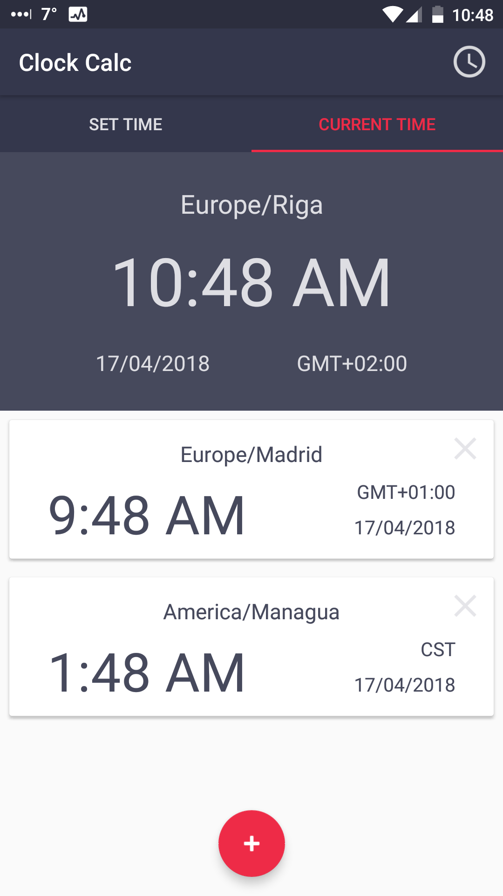
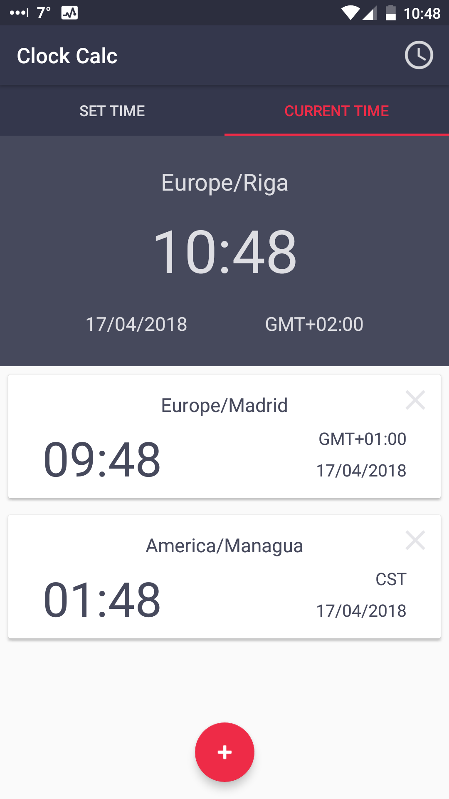
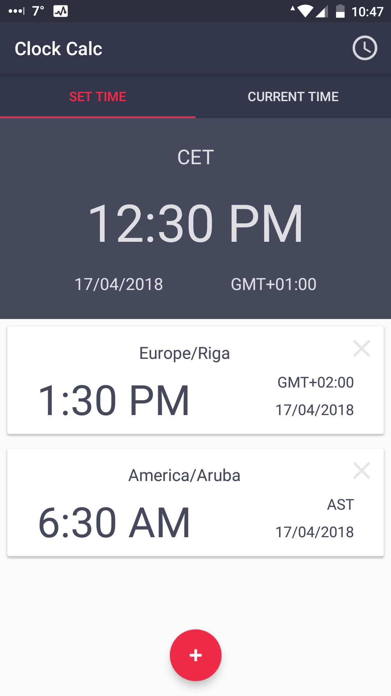
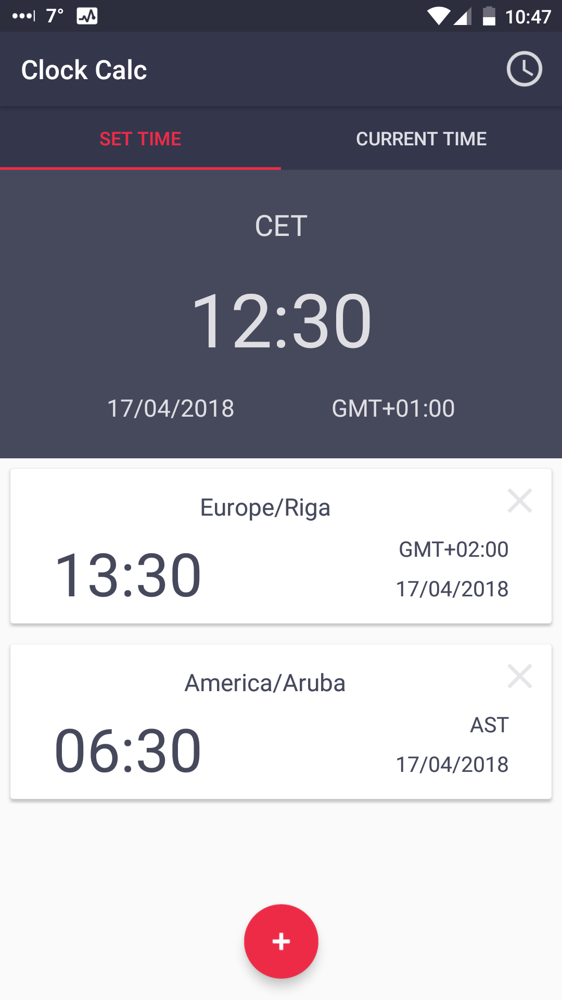
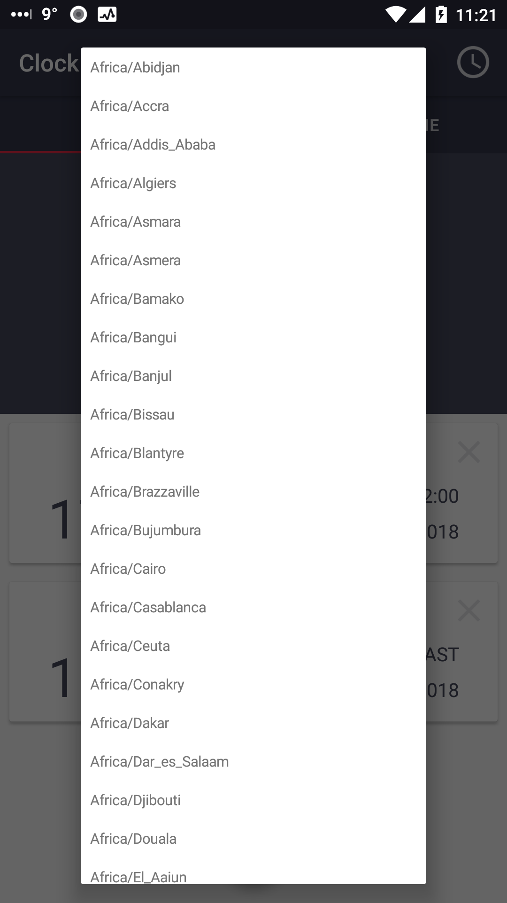
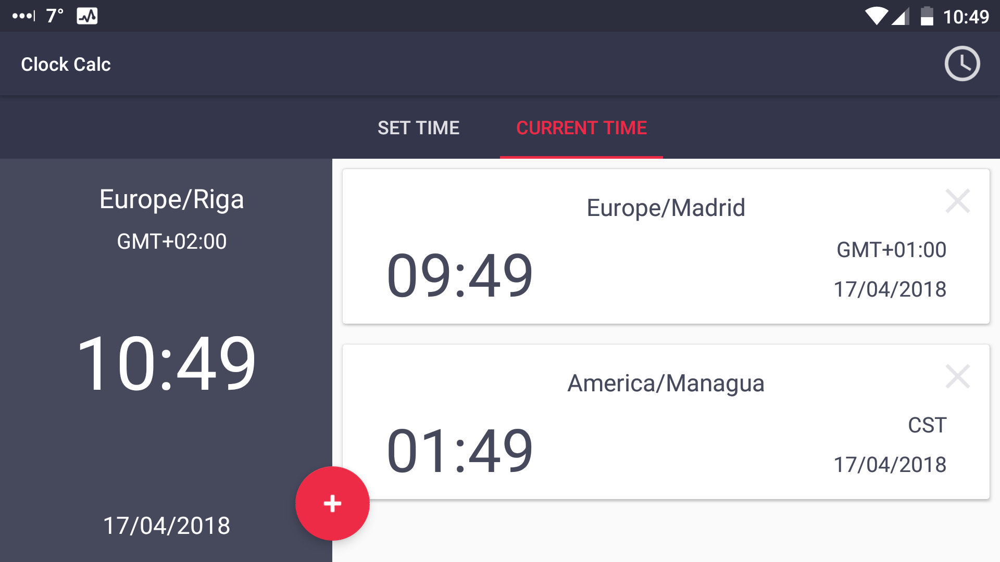

# ClockCalc
## Time Zone convertion app

* App allows the user to select a source time zone and time that will be converted to time in a corresponding destination time zone.
* Users selected time zones are stored in SQLite db, using SQLiteOpenHepler and ContentProvider
* User can switch between tabs with swipe, which is incorporated by ViewPager
* User can switch displayed time format between 24h/12h format by clicking clock icon in ActoinBar
* Users selected format is stored in SharedPreferences

  

 

 

 

